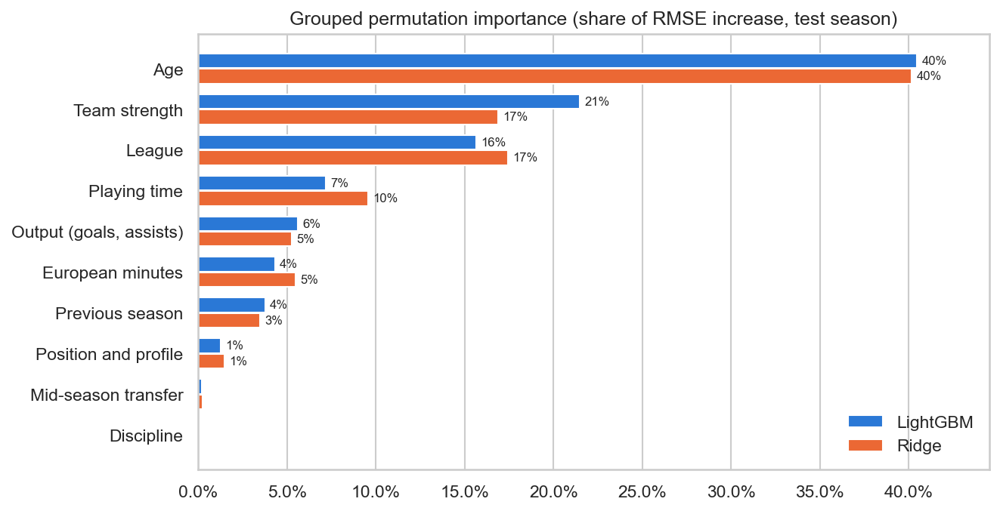
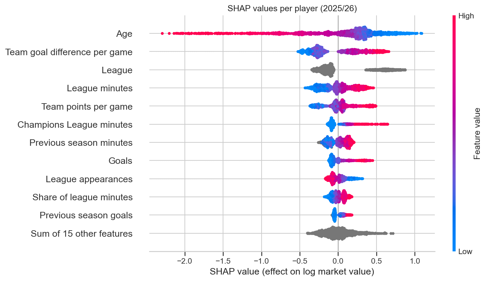
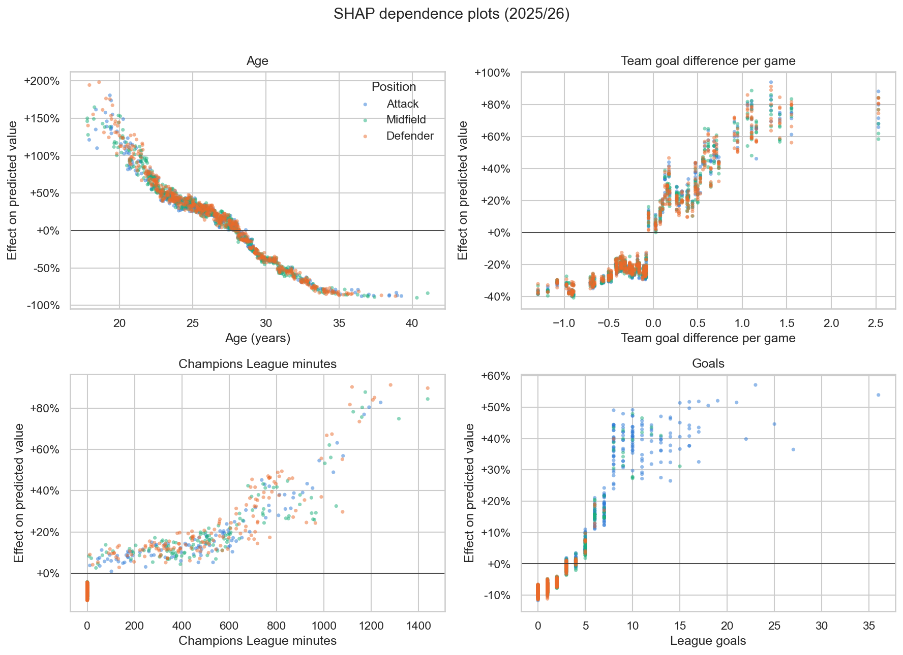
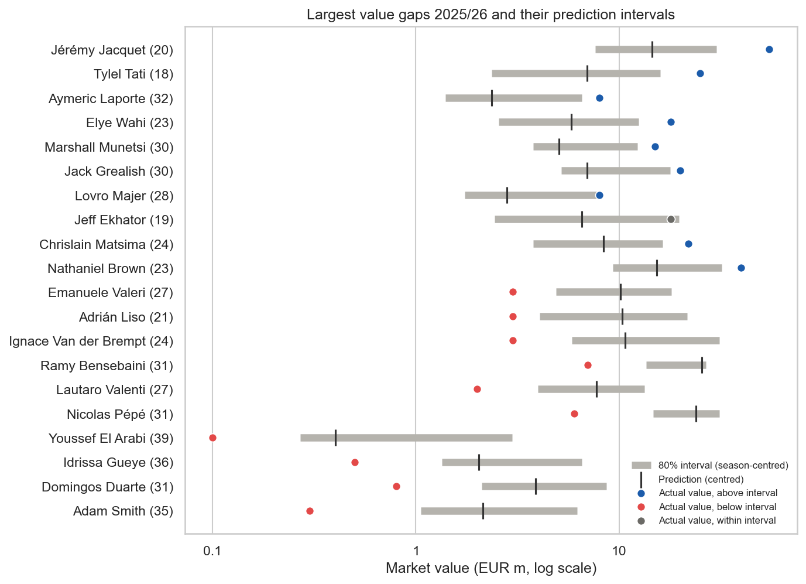
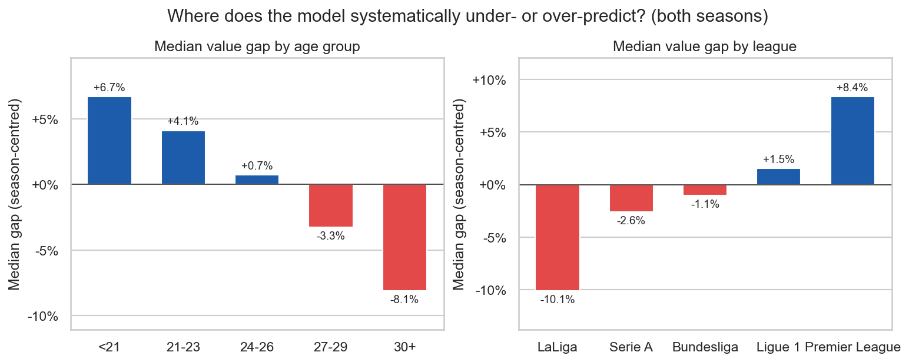

# What Drives a Footballer's Market Value?

A machine learning project that explains Transfermarkt market values of outfield players in Europe's Big 5 leagues
and flags players whose value deviates strongly from what their profile and performance suggest.

> **Status:** Day 4 of 7 · Models, SHAP analysis, value-gap list and deep dive (robustness, interactions, drift,
> prediction intervals) done. Next: Power BI dashboard.

## Business question

Clubs, agents and investors price players under high uncertainty. This project asks:

1. Which factors (age, playing time, output, league, team strength) explain market values?
2. Which players are valued well above or below what the data can explain?
3. Does a model trained on one season still hold for the next one?

Transfermarkt values are crowd-sourced estimates, not transfer fees. A large gap between model and market
therefore does not automatically mean mispricing: it can also reflect factors outside the data
(injuries, potential, hype). Interpreting these gaps is part of the analysis.

## Results so far

### 1. Model quality

Trained on **2024/25** (1,391 players), tested on the unseen season **2025/26** (1,482 players):

| Model | R² (log value) | RMSE (log) | Median abs. error in EUR |
|---|---:|---:|---:|
| Baseline: median by position × league × age group | 0.382 | 0.929 | 53.6% |
| Ridge regression | 0.851 | 0.456 | 29.3% |
| **LightGBM** | **0.855** | **0.451** | **28.7%** |


- **The model generalises:** test scores on 2025/26 match cross-validation on 2024/25 (R² 0.881).
- **Ridge is almost as accurate as LightGBM**, so a simple, interpretable model captures most of the signal.

### 2. What drives market value?

**Ranking by concept** (grouped permutation importance on the test season: how much the error rises when all
features of a concept are shuffled together). LightGBM and Ridge agree closely, so the ranking does not depend on
the algorithm:



- **Age (40%), team strength (17-22%) and league (16-17%)** explain most of what the model can explain.
  Playing time follows with 7-10%, goals and assists with 5-6%, European minutes with 4-6%.
- *Other importance measures in the notebooks (gain, mean |SHAP|) give lower single-feature shares, e.g. 23% for
  age, because correlated features split the credit. The order of the top drivers is the same with every method
  (rank correlation 0.93-0.96).*

**Direction of the effects** (SHAP, test season 2025/26):



- **Age:** an 18-year-old is predicted at roughly 2-3x the average player, a 33-year-old at less than half.
- **Team strength and Champions League:** players of dominant teams are predicted up to about +90% above average;
  1,200+ Champions League minutes add up to +90%.
- **League:** compared with the average player, the Premier League adds +86% and the other four leagues -9% to
  -23%. Put differently, a Premier League player is worth about 1.8x to 2.5x a comparable player elsewhere
  (+82% to +146% depending on age, peak at 27).
- **Goals:** the effect is real but small in the overall picture. One more goal adds about +4% for attackers, +5%
  for defenders and +6% for midfielders, so attackers are worth more because they score more, not because a goal
  counts more.
- **Effects are mostly additive** (Friedman's H-statistic: median 0.05, max 0.10), which explains why the linear
  Ridge model is almost as accurate as LightGBM.



### 3. Value gap: who is valued above or below the model?

Value gap = log(actual value) - log(predicted value). Two flags are computed per season:

- **Recommended: outside the 80% prediction interval.** Conformalized quantile regression gives each player an
  interval that holds out of sample (coverage 80.8% on 2025/26; raw quantile models only reach 68%). The median
  interval spans a factor of 3.8 (e.g. EUR 5m to 19m), so a point prediction alone overstates precision.
- **Simple alternative: top / bottom 10% of the gap.** Easy to explain, but ignores that some players are much
  harder to predict than others. Only 44% of the top-10% gaps also lie outside their interval: the same +80% gap
  can be normal for a 19-year-old and unusual for an established 27-year-old.



- **Above model:** mostly young talents at mid-table clubs (e.g. Jérémy Jacquet, 20, Rennes: EUR 55m vs EUR 12.6m
  predicted) and established names. Potential and reputation are not in the data.
- **Below model:** mostly players over 30, whom the market values lower than their age, team and output would
  suggest (e.g. Nicolas Pépé, 31, Villarreal: EUR 6m vs EUR 20.8m predicted).
- **Gaps are partly systematic:** under-21s sit about 7% above the model, over-30s about 8% below; LaLiga players
  about 10% below, Premier League players about 8% above.



- **Gaps persist:** r = 0.39 between seasons. 26% of players above the model in 2024/25 are above it again in
  2025/26 (10% expected by chance), which points to stable factors the data does not capture.

### 4. Does the model hold for the next season?

- Test scores on 2025/26 match cross-validation on 2024/25 (section 1).
- **Season shift:** the 2024/25 model under-predicts 2025/26 by about 15% on average, so flags are set per season.
  A drift analysis (population stability index) shows that all inputs are stable except team strength: the
  2025/26 sample contains more players from teams with a negative goal difference. About half of the shift is a
  7% higher value level, the other half comes from these lower predictions. It is not pure market inflation.

## Data

[transfermarkt-datasets](https://github.com/dcaribou/transfermarkt-datasets) by David Cariboo (CC0 license):
a DuckDB file with 12 tables (plus a version table) covering 50,000+ players, 88,000+ games and
650,000+ historical valuations. The upstream pipeline is paused; the snapshot used here runs until
**6 July 2026** (valuations until 12 June 2026).

## Scope and key design decisions

| Dimension | Choice |
|---|---|
| Leagues | Premier League, LaLiga, Serie A, Bundesliga, Ligue 1 |
| Players | Outfield players with at least 900 league minutes per season |
| Seasons | 2024/25 (train) and 2025/26 (test): temporal validation, no random split |
| Target | log(market value): latest valuation on or before 15 June after the season (DuckDB `ASOF JOIN`) |
| Unit | One row per player and season. Mid-season movers between Big 5 leagues are merged (stats summed, league with most minutes) and flagged |

**Deliberately excluded features**

- **Past market values:** the model would simply learn "last value" and explain nothing.
- **Contract length and international caps:** Transfermarkt only provides the current (mid-2026) snapshot. For
  2024/25 these columns contain later contract renewals and caps, i.e. information from the future. Example:
  0.0% of 2024/25 players appear to be in their final contract year, although in reality a sizeable share is.
  A comparison model including both columns scores slightly better in training (R² 0.886 vs 0.881) but brings
  no gain on the test season (0.851 vs 0.855).
- **Club squad value:** contains the player's own value (target leakage). Team strength uses results instead.

## Limitations

- Valuations for 2024/25 are older on average: 16% are 90-180 days old at the cutoff vs 0.1% for 2025/26.
  Valuations older than 180 days are dropped (59 rows).
- The data has no defensive or possession statistics (tackles, passes, xG), so defenders' and midfielders'
  qualities are only partly visible to the model.
- Team strength is a strong driver: part of what the model learns is "players at top clubs are worth more".

## How to reproduce

```powershell
# 1. Create and activate a virtual environment
python -m venv .venv
.venv\Scripts\activate

# 2. Install dependencies
pip install -r requirements.txt

# 3. Download the database (~200 MB) into data\raw
curl.exe -L -o data\raw\transfermarkt-datasets.duckdb https://pub-e682421888d945d684bcae8890b0ec20.r2.dev/data/transfermarkt-datasets.duckdb

# 4. Build the modelling table and train the models
python -m src.build_dataset    # -> data/processed/player_seasons.parquet
python -m src.train_models     # -> predictions, metrics, fitted models
python -m src.value_gap        # -> value_gaps.csv and shap_values.csv for the dashboard
```

The notebooks explain each step and can be opened with `jupyter lab` or VS Code. The database path can be
changed via the `TM_DB_PATH` environment variable. Optional: explore the tables interactively with the DuckDB UI
(`winget install DuckDB.cli`, then `duckdb -ui data\raw\transfermarkt-datasets.duckdb`).

## Project structure

```
football-player-valuation/
├── data/
│   ├── raw/                  # transfermarkt-datasets.duckdb (not tracked)
│   └── processed/            # modelling table and predictions (not tracked, re-created by the scripts)
├── notebooks/
│   ├── 01_eda.ipynb          # data coverage, target definition, design decisions
│   ├── 02_modelling.ipynb    # baseline, Ridge, LightGBM explained step by step
│   ├── 03_shap_value_gap.ipynb  # drivers (SHAP) and value-gap analysis
│   └── 04_deep_dive.ipynb    # robustness, interactions, drift, prediction intervals
├── src/
│   ├── config.py             # single source of truth: paths, scope, target, feature lists
│   ├── db.py                 # DuckDB connection and query helpers
│   ├── build_dataset.py      # SQL pipeline -> one row per player-season
│   ├── train_models.py       # training, temporal validation, predictions
│   ├── value_gap.py          # value gap, prediction intervals, SHAP drivers, dashboard exports
│   └── diagnostics.py        # grouped importance, H-statistic, partial dependence, PSI drift
├── reports/
│   ├── figures/              # exported charts
│   └── model_metrics.csv     # train CV and test metrics per model
├── dashboard/                # Power BI report (day 5)
└── requirements.txt
```

## Roadmap

- [x] Day 1: EDA, data coverage, target definition
- [x] Day 2: SQL pipeline for the player-season modelling dataset
- [x] Day 3: Baseline, Ridge and LightGBM with temporal validation
- [x] Day 4: SHAP analysis and value-gap list
- [x] Day 4+: Deep dive (driver robustness, interactions, drift, prediction intervals)
- [ ] Day 5: Power BI dashboard
- [ ] Day 6-7: Documentation and polish

## Tech stack

Python · DuckDB/SQL · pandas · scikit-learn · LightGBM · SHAP · Power BI

## License

Code: [MIT](LICENSE). Data: [transfermarkt-datasets](https://github.com/dcaribou/transfermarkt-datasets) (CC0),
not included in this repository.
