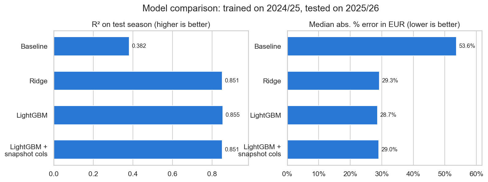
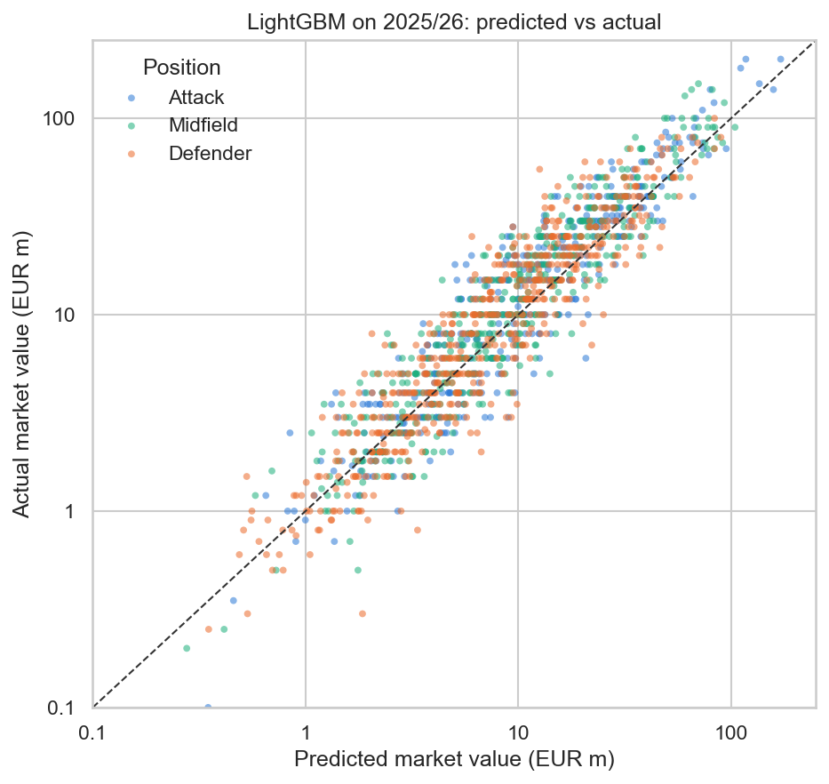

# What Drives a Footballer's Market Value?

A machine learning project that explains Transfermarkt market values of outfield players in Europe's Big 5 leagues
and flags players whose value deviates strongly from what their profile and performance suggest.

> **Status:** Day 3 of 7 · Models trained and validated. Next: SHAP analysis and value-gap list.

## Business question

Clubs, agents and investors price players under high uncertainty. This project asks:

1. Which factors (age, playing time, output, league, team strength) explain market values?
2. Which players are valued well above or below what the data can explain?
3. Does a model trained on one season still hold for the next one?

Transfermarkt values are crowd-sourced estimates, not transfer fees. A large gap between model and market
therefore does not automatically mean mispricing: it can also reflect factors outside the data
(injuries, potential, hype). Interpreting these gaps is part of the analysis.

## Results so far

Trained on **2024/25** (1,391 players), tested on the unseen season **2025/26** (1,482 players):

| Model | R² (log value) | RMSE (log) | Median abs. error in EUR |
|---|---:|---:|---:|
| Baseline: median by position × league × age group | 0.382 | 0.929 | 53.6% |
| Ridge regression | 0.851 | 0.456 | 29.3% |
| **LightGBM** | **0.855** | **0.451** | **28.7%** |



- **The model generalises:** test scores on 2025/26 match cross-validation on 2024/25 (R² 0.881).
- **Ridge is almost as accurate as LightGBM**, so a simple, interpretable model captures most of the signal.
- **Main drivers:** age and team strength (goal difference and points per game of the club), followed by league
  and Champions League minutes. Positions differ in raw value (attackers median EUR 14m vs defenders EUR 8m),
  but most of that gap is explained by goals and assists rather than by the position itself.



Points above the diagonal are players valued higher than the data explains (positive value gap).

## Data

[transfermarkt-datasets](https://github.com/dcaribou/transfermarkt-datasets) by David Cariboo (CC0 license):
a DuckDB file with 12 tables (plus a version table) covering 50,000+ players, 88,000+ games and
650,000+ historical valuations. The upstream pipeline is paused; the snapshot used here runs until
**6 July 2026** (valuations until 12 June 2026).

## Scope and key design decisions

| Dimension | Choice |
|---|---|
| Leagues | Premier League, LaLiga, Serie A, Bundesliga, Ligue 1 |
| Players | Outfield players with at least 900 league minutes per season |
| Seasons | 2024/25 (train) and 2025/26 (test): temporal validation, no random split |
| Target | log(market value): latest valuation on or before 15 June after the season (DuckDB `ASOF JOIN`) |
| Unit | One row per player and season. Mid-season movers between Big 5 leagues are merged (stats summed, league with most minutes) and flagged |

**Deliberately excluded features**

- **Past market values:** the model would simply learn "last value" and explain nothing.
- **Contract length and international caps:** Transfermarkt only provides the current (mid-2026) snapshot. For
  2024/25 these columns contain later contract renewals and caps, i.e. information from the future. Example:
  0.0% of 2024/25 players appear to be in their final contract year, although in reality a sizeable share is.
  A comparison model including both columns scores slightly better in training (R² 0.886 vs 0.881) but brings
  no gain on the test season (0.851 vs 0.855).
- **Club squad value:** contains the player's own value (target leakage). Team strength uses results instead.

## Limitations

- Valuations for 2024/25 are older on average: 16% are 90-180 days old at the cutoff vs 0.1% for 2025/26.
  Valuations older than 180 days are dropped (59 rows).
- The data has no defensive or possession statistics (tackles, passes, xG), so defenders' and midfielders'
  qualities are only partly visible to the model.
- Team strength is a strong driver: part of what the model learns is "players at top clubs are worth more".

## How to reproduce

```powershell
# 1. Create and activate a virtual environment
python -m venv .venv
.venv\Scripts\activate

# 2. Install dependencies
pip install -r requirements.txt

# 3. Download the database (~200 MB) into data\raw
curl.exe -L -o data\raw\transfermarkt-datasets.duckdb https://pub-e682421888d945d684bcae8890b0ec20.r2.dev/data/transfermarkt-datasets.duckdb

# 4. Build the modelling table and train the models
python -m src.build_dataset    # -> data/processed/player_seasons.parquet
python -m src.train_models     # -> predictions, metrics, fitted models
```

The notebooks explain each step and can be opened with `jupyter lab` or VS Code. The database path can be
changed via the `TM_DB_PATH` environment variable. Optional: explore the tables interactively with the DuckDB UI
(`winget install DuckDB.cli`, then `duckdb -ui data\raw\transfermarkt-datasets.duckdb`).

## Project structure

```
football-player-valuation/
├── data/
│   ├── raw/                  # transfermarkt-datasets.duckdb (not tracked)
│   └── processed/            # modelling table and predictions (not tracked, re-created by the scripts)
├── notebooks/
│   ├── 01_eda.ipynb          # data coverage, target definition, design decisions
│   └── 02_modelling.ipynb    # baseline, Ridge, LightGBM explained step by step
├── src/
│   ├── config.py             # single source of truth: paths, scope, target, feature lists
│   ├── db.py                 # DuckDB connection and query helpers
│   ├── build_dataset.py      # SQL pipeline -> one row per player-season
│   └── train_models.py       # training, temporal validation, predictions
├── reports/
│   ├── figures/              # exported charts
│   └── model_metrics.csv     # train CV and test metrics per model
├── dashboard/                # Power BI report (day 5)
└── requirements.txt
```

## Roadmap

- [x] Day 1: EDA, data coverage, target definition
- [x] Day 2: SQL pipeline for the player-season modelling dataset
- [x] Day 3: Baseline, Ridge and LightGBM with temporal validation
- [ ] Day 4: SHAP analysis and value-gap list
- [ ] Day 5: Power BI dashboard
- [ ] Day 6-7: Documentation and polish

## Tech stack

Python · DuckDB/SQL · pandas · scikit-learn · LightGBM · SHAP · Power BI

## License

Code: [MIT](LICENSE). Data: [transfermarkt-datasets](https://github.com/dcaribou/transfermarkt-datasets) (CC0),
not included in this repository.
